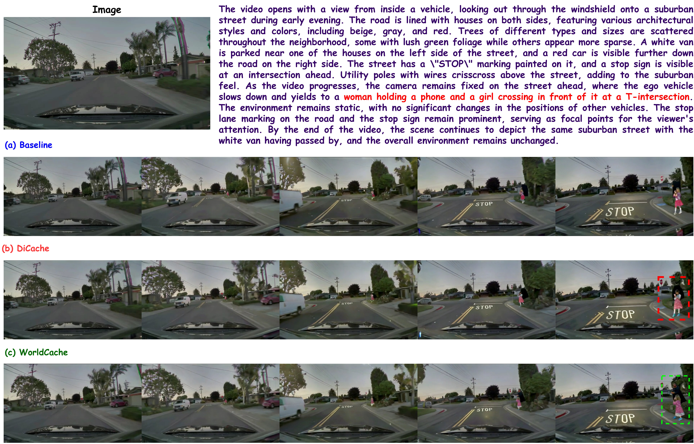
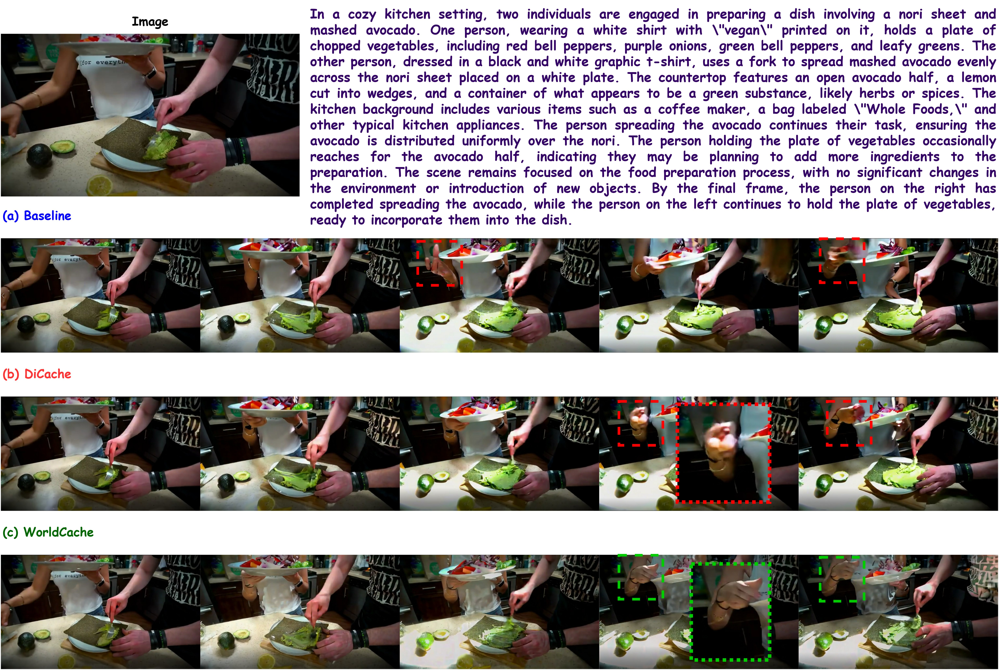
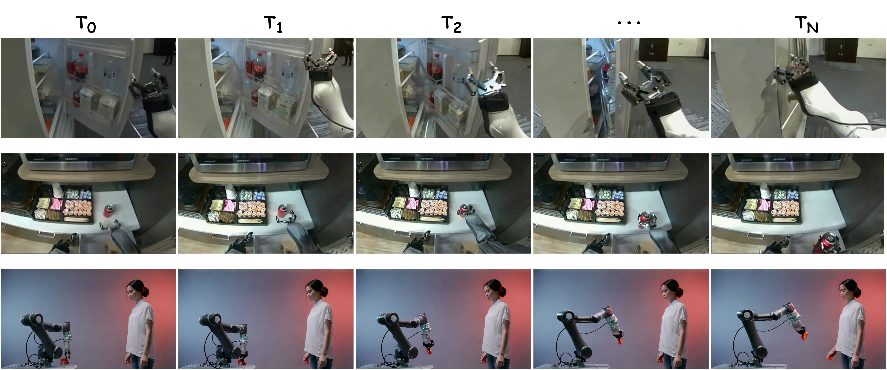
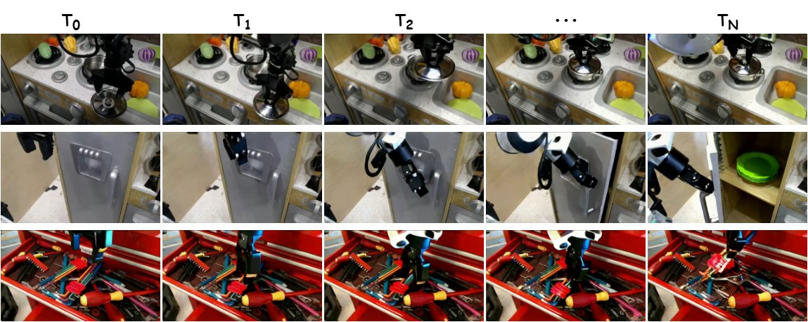

<h1 align="left">
   🌍 WorldCache: Content-Aware Caching for Accelerated Video World Models
</h1>


<p align="center">
  <a href="https://arxiv.org/abs/" target="_blank">
    
  </a>
  <a href="https://umair1221.github.io/World-Cache/" target="_blank">
    
  </a>
  <a href="https://github.com/umair1221/WorldCache/blob/main/LICENSE">
    
  </a>
  <a href="https://img.shields.io/badge/PyTorch-EE4C2C?style=flat&logo=pytorch&logoColor=white">
    
  </a>
</p>
<p align="center">
    
</p>

#### [Umair Nawaz](https://scholar.google.com/citations?user=w7N4wSYAAAAJ&hl=en), [Awais Muhammad](https://scholar.google.com/citations?user=bA-9t1cAAAAJ&hl=en), [Hanan Gani](https://hananshafi.github.io/), [Muzammal Naseer](https://muzammal-naseer.com/), [Fahad Khan](https://sites.google.com/view/fahadkhans/home), [Salman Khan](https://salman-h-khan.github.io/), [Rao M. Anwer](https://scholar.google.fi/citations?user=_KlvMVoAAAAJ&hl=en)


<p align="center">
  <strong>WorldCache</strong> is a <strong>training-free, plug-and-play</strong> inference acceleration framework for diffusion-based video world models. It achieves up to <strong>3.0× speedup</strong> while strictly maintaining temporal coherence and visual fidelity.
</p>

---

## 🎬 Qualitative Preview

<p align="center">
  <strong>High-fidelity video generation on Cosmos-Predict 2.5 (14B) with 2.3x - 3.0x speedup.</strong>
</p>

<div align="center">
  <table align="center">
    <tr>
      <td></td>
      <td></td>
    </tr>
    <tr>
      <td></td>
      <td></td>
    </tr>
  </table>
</div>

---

<p align="center">
  
</p>

---

## 📖 Abstract

Video World Models (VWMs) increasingly rely on large-scale diffusion transformers to simulate complex spatial dynamics. However, the high computational cost of autoregressive generation remains a significant bottleneck. **WorldCache** overcomes this by identifying temporal and spatial redundancies in the denoising process. 

> [!TIP]
> **WorldCache** is backbone-agnostic and training-free. It can be integrated into existing diffusion pipelines with just a few lines of code.

Unlike naive caching which causes "motion drift," WorldCache uses a suite of content-aware modules like **Causal Feature Caching (CFC)**, **Saliency-Weighted Drift (SWD)**, **Optimal Feature Approximation (OFA)**, and **Adaptive Threshold Scheduling (ATS)** to predict skipped computation rather than blindly copying it. Our method generalizes across leading architectures like **NVIDIA Cosmos**, **WAN2.1**, and **DreamDojo**.

---

## ✨ Key Components

WorldCache is driven by four key technical ideologies:

| Module | Icon | Description |
| :--- | :---: | :--- |
| **Causal Feature Caching (CFC)** | ⚡ | Dynamically scales caching tolerance based on early layer motion velocity. |
| **Saliency-Weighted Drift (SWD)** | 🎯 | Penalizes caching errors in perceptually critical high-frequency regions. |
| **Optimal Feature Approx. (OFA)** | 🌊 | Interpolates skipped cache states using trajectory matching and optical flow. |
| **Adaptive Threshold Scheduling (ATS)** | 📈 | Exponentially relaxes caching constraints in later denoising stages. |

---

## 🔬 Method Overview

WorldCache treats caching like a localized prediction. It controls the pace with causal tracking while interpolating the next state.

<p align="center">
  
</p>

### 🛠️ Technical Highlights
- **Drift Probing:** Uses the first $K$ blocks of the transformer as a lightweight proxy for global drift.
- **Motion-Adaptive Thresholds:** Uses $\alpha$-scaled motion signals to prevent "ghosting" artifacts in high-dynamics scenes.
- **Saliency Mapping:** Weights L1 drift by spatial saliency (channel-wise variance) to preserve fine details.

---

## ⚙️ Installation & Setup

For detailed system requirements, environment setup (Virtual Env/Docker), and checkpoint downloading instructions, please refer to our:

👉 **[Detailed Setup Guide](Models/Cosmos-Predict2.5/docs/setup.md)**

### ⚡ Quick Summary (Conda + UV)
```bash
# 1. Create and activate conda environment
conda create -n worldcache python=3.10 -y
conda activate worldcache

# 2. Sync dependencies with UV
curl -LsSf https://astral.sh/uv/install.sh | sh
cd Models/Cosmos-Predict2.5/
uv sync --extra=cu128 --active --inexact

# 3. Basic inference (from root)
python Models/Cosmos-Predict2.5/examples/inference.py --model 2B/post-trained --worldcache_enabled [options]
```

---

## 🚀 Quick Start

To generate high-quality video with WorldCache acceleration:

```bash
# From the root of the repository - Text2World
CUDA_VISIBLE_DEVICES=0 python Models/Cosmos-Predict2.5/examples/inference.py \
  -i Models/Cosmos-Predict2.5/path/to/prompt.json \
  -o outputs/worldcache_output \
  --inference-type=text2world \
  --model 2B/post-trained \
  --disable-guardrails \
  --worldcache_enabled \
  --worldcache_motion_sensitivity 2.0 \
  --worldcache_flow_enabled \
  --worldcache_flow_scale 2.0 \
  --worldcache_osi_enabled \
  --worldcache_saliency_enabled \
  --worldcache_saliency_weight 1.0 \
  --worldcache_dynamic_decay

# From the root of the repository - Image2World
CUDA_VISIBLE_DEVICES=0 python Models/Cosmos-Predict2.5/examples/inference.py \
  -i Models/Cosmos-Predict2.5/path/to/prompt.json \
  -o outputs/worldcache_output \
  --inference-type=image2world \
  --model 2B/post-trained \
  --disable-guardrails \
  --worldcache_enabled \
  --worldcache_motion_sensitivity 2.0 \
  --worldcache_flow_enabled \
  --worldcache_flow_scale 2.0 \
  --worldcache_osi_enabled \
  --worldcache_saliency_enabled \
  --worldcache_saliency_weight 1.0 \
  --worldcache_dynamic_decay
```

---

## 📊 Quantitative Results

WorldCache establishes a new state-of-the-art for training-free diffusion acceleration, maintaining near-baseline quality while significantly reducing latency.

---

### 🌐 Model & Benchmark Coverage
| Model Family | Scales | Architecture | PAI-Bench | EgoDex-Eval |
| :--- | :--- | :---: | :---: | :---: |
| **Cosmos-Predict 2.5** | 2B, 14B | DiT | ✅ | ✅ |
| **WAN2.1** | 1.3B, 14B | DiT | ✅ | ✅ |
| **DreamDojo** | 2B | DiT | — | ✅ |

---

### 1. PAI-Bench: Physical Reasoning Benchmarks
Across two major architectures (**Cosmos** and **WAN**), WorldCache consistently delivers >2× speedup with <1% drop in overall physical reasoning scores.

**Table 1: PAI-Bench Text-to-World (T2W) Results**
| Model | Method | Domain Avg | Quality Avg | Overall | Latency (s) | Speedup |
| :--- | :--- | :---: | :---: | :---: | :---: | :---: |
| **Cosmos 2B** | Baseline | 0.767 | 0.728 | 0.748 | 58.34 | 1.00× |
| | DiCache | 0.759 | 0.727 | 0.743 | 40.82 | 1.43× |
| | **WorldCache** | **0.763** | **0.727** | **0.745** | **26.78** | **2.18×** |
| **Cosmos 14B** | Baseline | 0.792 | 0.746 | 0.769 | 216.25 | 1.00× |
| | DiCache | 0.792 | 0.745 | 0.768 | 148.36 | 1.45× |
| | **WorldCache** | **0.795** | **0.746** | **0.771** | **114.76** | **1.90×** |

**Table 2: PAI-Bench Image-to-World (I2W) Results**
| Model | Method | Domain Avg | Quality Avg | Overall | Latency (s) | Speedup |
| :--- | :--- | :---: | :---: | :---: | :---: | :---: |
| **Cosmos 2B** | Baseline | 0.845 | 0.761 | 0.803 | 57.04 | 1.00× |
| | DiCache | 0.835 | 0.752 | 0.794 | 39.68 | 1.46× |
| | **WorldCache** | **0.840** | **0.756** | **0.798** | **25.96** | **2.30×** |
| **Cosmos 14B** | Baseline | 0.860 | 0.769 | 0.814 | 210.07 | 1.00× |
| | DiCache | 0.855 | 0.767 | 0.811 | 146.04 | 1.44× |
| | **WorldCache** | **0.859** | **0.768** | **0.813** | **112.24** | **1.87×** |

---
### 2. Architecture Transfer: WAN2.1
WorldCache is backbone-agnostic. On the latest **WAN2.1** architecture, it achieves superior speed-quality tradeoffs compared to DiCache.

**Table 3: WAN2.1 Transfer Results**
| Backbone | Method | Overall | Latency (s) | Speedup |
| :--- | :--- | :---: | :---: | :---: |
| **T2W 1.3B** | Baseline | 0.7727 | 120.04 | 1.00× |
| | DiCache | 0.7703 | 61.57 | 1.96× |
| | **WorldCache** | **0.7721** | **50.84** | **2.36×** |
| **I2W 14B** | Baseline | 0.7384| 475.60 | 1.00× |
| | DiCache | 0.7311 | 291.91 | 1.53× |
| | **WorldCache** | **0.7388** | **206.73** | **2.31×** |

---
### 3. EgoDex-Eval: Robotics Performance
In egocentric robotics tasks requiring high spatial precision, WorldCache maintains frame-level fidelity (PSNR/SSIM) while enabling real-time-friendly inference.

**Table 4: EgoDex-Eval (Robotics Evaluation)**
| Model | Method | PSNR | SSIM | LPIPS | Latency (s) | Speedup |
| :--- | :--- | :---: | :---: | :---: | :---: | :---: |
| **WAN2.1-14B** | Baseline | 13.30 | 0.503 | 0.459 | 391.90 | 1.00× |
| | DiCache | 12.95 | 0.491 | 0.461 | 208.60 | 1.88× |
| | **WorldCache** | **13.19** | **0.498** | **0.460** | **171.60** | **2.30×** |
| **Cosmos-2.5-2B**| Baseline | 12.87 | 0.455 | 0.518 | 70.01 | 1.00× |
| | DiCache | 12.63 | 0.445 | 0.531 | 51.97 | 1.34× |
| | **WorldCache** | **12.82** | **0.466** | **0.518** | **43.24** | **1.62×** |
| **DreamDojo-2B** | Baseline | 23.63 | 0.775 | 0.226 | 19.73 | 1.00× |
| | DiCache | 20.41 | 0.734 | 0.252 | 12.46 | 1.58× |
| | **WorldCache** | **23.69** | **0.737** | **0.251** | **10.36** | **1.90×** |

---

## 📈 Denoising Step Budget Scaling

WorldCache scales effectively with the denoising step budget. For longer generation trajectories (more steps), the efficiency gains increase as the underlying motion manifold stabilizes.

<p align="center">
  
  <br>
  <em>Efficiency scaling: WorldCache achieves up to 3.1× speedup as denoising steps increase, while maintaining superior quality over DiCache.</em>
</p>

---

## 🖼️ Qualitative Gallery

WorldCache maintains flawless temporal coherence across diverse domains, from urban traffic to precision robotics.

<p align="center">
  
  <em>Main comparison: WorldCache stays closer to baseline rollout in dynamic and interaction-heavy regions.</em>
</p>

<div align="center">
  <table>
    <tr>
      <td><br><em>Cosmos-2B crossing scene: Preserves pedestrian identity and background consistency.</em></td>
      <td><br><em>Cosmos-14B kitchen interaction: Stable hand and carried object tracking.</em></td>
    </tr>
    <tr>
      <td><br><em>Dynamic scene: Balanced performance in high-velocity regions.</em></td>
      <td><br><em>Consistency: Zero "ghosting" artifacts at 2.5×+ speedup.</em></td>
    </tr>
  </table>
</div>

---

## 🙏 Acknowledgements

We acknowledge the following works that inspired this project:

- **[Cosmos-Predict 2.5](https://github.com/nvidia-cosmos/cosmos-predict2.5)** — NVIDIA's world foundation model platform.
- **[WAN2.1](https://github.com/Wan-Video/Wan2.1)** — Open suite of video foundation models.
- **[DreamDojo](https://github.com/NVIDIA/DreamDojo)** — Generalist robot world model from the NVIDIA GEAR Team.
- **[DiCache](https://github.com/Bujiazi/DiCache)** — *DiCache: Let Diffusion Model Determine Its Own Cache*, ICLR 2026.

---

## 📝 Citation

```bibtex
@inproceedings{nawaz2026worldcache,
  title     = {WorldCache: Content-Aware Caching for Accelerated Video World Models},
  author    = {Umair Nawaz and Ahmed Heakl and Ufaq Khan and Abdelrahman Shaker and Salman Khan and Fahad Shahbaz Khan},
  journal   = {arXiv preprint arXiv:2603.XXXXX},
  year      = {2026}
}
```

## 📄 License

This project inherits the [Apache 2.0 License](LICENSE) from the NVIDIA Cosmos-Predict2 codebase.
